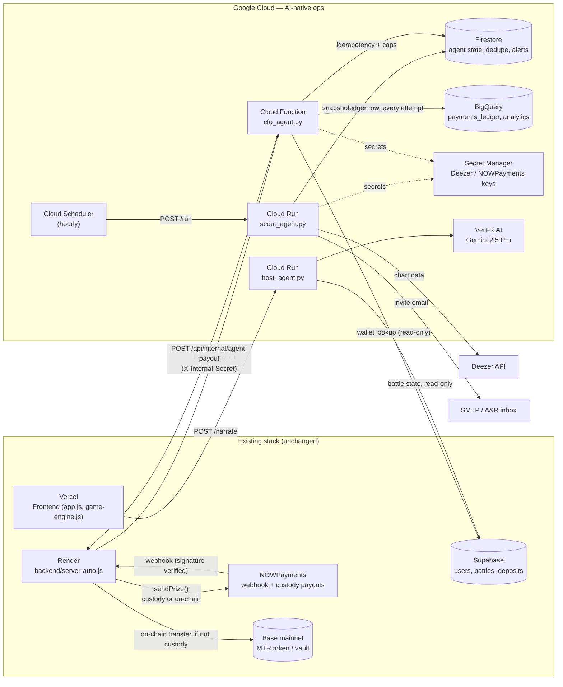

# Architecture — MTR + GCP AI-Native Ops Layer

## Principle

**Wrap, don't rewrite.** Vercel (frontend), Supabase (DB of record), Render
(Node backend, `server-auto.js`), and NOWPayments (payment rail) keep doing
exactly what they do today. Google Cloud adds a new layer of autonomous
operations on top, talking to the existing stack only over REST / already
proven server-to-server auth patterns (`requireInternalSecret`).

## Security rationale (read before touching payments)

The repo already documents a real incident:
`ANALISIS-VULNERABILIDAD-CONFIRMADA.md` and `RESUMEN-FUGA-FONDOS.md` describe
a confirmed theft of 5.29 USDC from the treasury/vault wallet on 2026-03-07,
via `/api/claim` accepting an arbitrary `walletAddress` in the request body
without verifying it belonged to the authenticated user. That specific bug
was fixed by looking the wallet up from `users.wallet_address` instead of
trusting the payload.

Every new money-moving path added here follows the same rule:

1. **CFO agent is never public.** NOWPayments' IPN signature is verified
   once, in `backend/server-auto.js` (`nowpayments-service.js`), which is
   already hardened for that job. The CFO agent's `/payout` route is called
   server-to-server with a shared secret (`CFO_AGENT_SHARED_SECRET`) — it is
   a second stage of an already-authenticated event, not a second front door.
2. **Wallet of record = Supabase, always.** `PaymentEvent` has no wallet
   field. The CFO agent looks the artist's wallet up by `artist_user_id`;
   there is no code path where a caller-supplied address reaches a payout.
3. **The CFO agent holds no private key.** It calls
   `POST /api/internal/agent-payout` (new route in `server-auto.js`, guarded
   by the existing `requireInternalSecret` middleware) which reuses
   `prize-service.js::sendPrize` — the same, already-audited signer used
   elsewhere in the platform. One signer, one key, one audit surface.
4. **Idempotency + caps + circuit breaker.** Every `payment_id` is processed
   once (Firestore dedupe). Per-transaction (`CFO_PER_TX_CAP_USD`) and daily
   (`CFO_DAILY_CAP_USD`) caps stop a bug or an attack from draining funds
   before a human notices — the agent refuses and raises a Firestore alert
   instead of paying past the cap.
5. **Full audit trail.** Paid, rejected, and failed attempts all get a
   BigQuery row, so the P&L and the security review are the same data.

## Data ownership

- **Supabase** stays the single source of truth for users, wallets, battles,
  credits, deposits — nothing here duplicates or overrides that.
- **Firestore** only holds agent-internal state: Deezer snapshots, scout
  detections, CFO idempotency records, caps/alerts. If Firestore is wiped,
  the platform's actual balances are unaffected (worst case: the daily cap
  counter resets, or a duplicate detection email goes out).
- **BigQuery** is analytics/reporting only, fed by an insert-only ledger.

## Known follow-up: host-agent's Supabase key

`host-agent` is deployed publicly (`--allow-unauthenticated`, since the
Vercel frontend calls it directly from the browser flow) and currently has
**no** Supabase credentials wired in — it runs on its deterministic fallback
narration instead of live battle context. Do not fix this by attaching
`SUPABASE_SERVICE_ROLE_KEY` (full write/bypass-RLS privilege) to a public
service — that combination was specifically blocked during this build.
Instead, create a Supabase **anon key** scoped by a read-only RLS policy on
`battles` (score/status/artist names only, no financial columns) and set that
as `SUPABASE_URL`/a new `SUPABASE_ANON_KEY` env var for `host-agent` only;
`cfo-agent` and `scout-agent` keep the service-role key since they're not
public.
